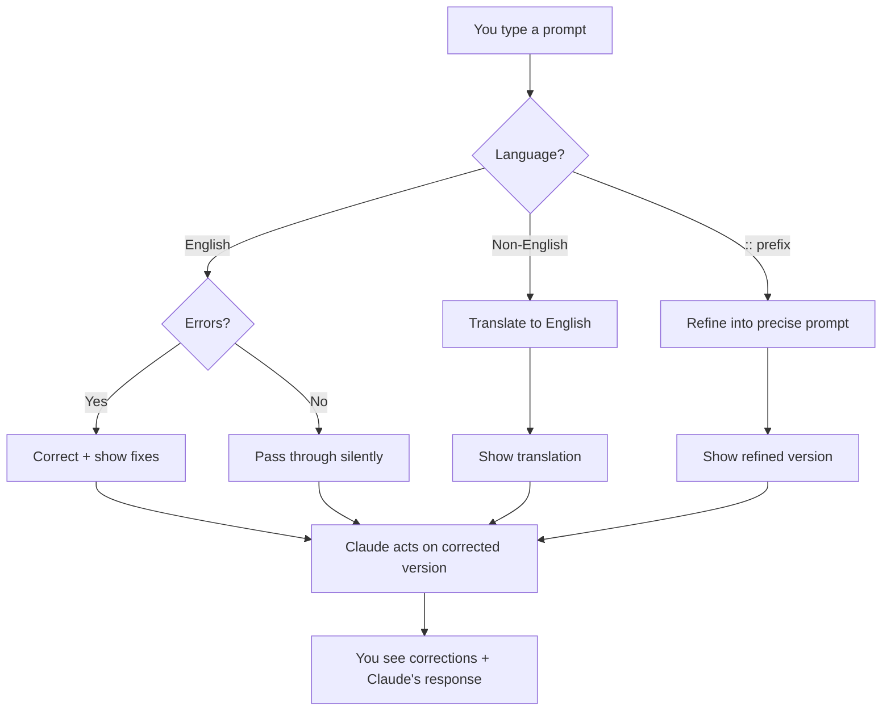

# claude-english-buddy

English language coach for non-native speakers who use Claude Code daily.

## The Problem

LLMs understand broken English perfectly. They never correct you. They never push back. They just... comply.

This means every typo, every grammar mistake, every awkward phrasing you type goes unchallenged. Over months of daily AI interaction, bad patterns calcify. Your English doesn't improve — it quietly degrades, because the feedback loop that would catch your mistakes no longer exists.

You're not getting worse at English. You're losing the signal that would make you better.

## The Solution

claude-english-buddy restores the feedback loop. It sits between you and Claude, silently correcting your prompts and showing you what was wrong — every time, automatically, with zero friction.

```
You type:    "refactor the autentication modul, its got too many responsibilties"

You see:     Refactor the authentication module. It has too many responsibilities.
             (autentication>authentication; modul>module; its got>it has; responsibilties>responsibilities)

Claude sees: the corrected version, responds normally.
```

When your prompt is clean — silence. No noise. Silence means correct.

Over weeks, you start noticing fewer corrections. That's the feedback loop working.

## How It Works



Four modes, one hook, zero friction:

| Mode | Trigger | What Happens |
|------|---------|-------------|
| **Correct** | English prompt with errors | Fixes typos/grammar, shows what changed |
| **Translate** | Non-English detected | Translates to English, shows translation |
| **Refine** | `::` prefix | Rewrites into a precise, structured prompt |
| **Summarize** | `summary_language` configured | Claude appends native-language summary |

## Install

```bash
/plugin marketplace add xiaolai/claude-plugin-marketplace
/plugin install claude-english-buddy@xiaolai
```

> **Install fails with "Plugin not found in marketplace 'xiaolai'"?** Your local marketplace clone is stale. Run `claude plugin marketplace update xiaolai` and retry — `plugin install` does not auto-refresh.

## Commands

| Command | Description |
|---------|-------------|
| `/claude-english-buddy:today` | Today's correction report — mistakes, patterns, lessons, trend |
| `/claude-english-buddy:stats` | Long-term trends — error rate over weeks, improvement trajectory |
| `/claude-english-buddy:mistakes` | All-time recurring mistakes — your blind spots |
| `/claude-english-buddy:config` | Configure language, strictness, domain terms |
| `/claude-english-buddy:review` | Deep review of any text (docs, PRs, emails) |

## Daily Report

The most powerful feature. Run `/claude-english-buddy:today` at the end of your day:

```markdown
# Today's Language Report — 2026-04-01

## Overview

| Metric | Today | Yesterday | 7-day avg |
|--------|------:|----------:|----------:|
| Prompts | 34 | 41 | 37 |
| Corrections | 8 (24%) | 14 (34%) | 11 (30%) |
| Clean prompts | 24 (71%) | 27 (66%) | 25 (68%) |

## Today's Corrections

| # | You Wrote | Corrected | Pattern |
|---|-----------|-----------|---------|
| 1 | "its got too many" | "it has too many" | its vs it's |
| 2 | "autentication" | "authentication" | spelling |
| 3 | "the modul is" | "the module is" | spelling |
| ...

## Lessons of the Day

1. **"who" vs "that"** — Use "who" for people, "that" for things.
   Wrong: "the function who handles auth"
   Right: "the function that handles auth"

## Trend

You're improving. Error rate down 37% in 3 weeks.
```

## Configuration

### Project config (`.claude-english-buddy.json`)

```json
{
  "auto_correct": true,
  "summary_language": "Chinese",
  "strictness": "standard",
  "domain_terms": ["Tailscale", "Headscale", "MagicDNS"]
}
```

### Global config (`~/.claude/hooks/prompt_coach.json`)

Same format. Project config overrides global.

### AWS Bedrock

If Claude Code itself is running on Bedrock (`CLAUDE_CODE_USE_BEDROCK=1`), the
hook automatically routes its own Haiku calls through Bedrock using your AWS
credentials — no separate `ANTHROPIC_API_KEY` needed. Region comes from
`AWS_REGION` / `AWS_DEFAULT_REGION`; credentials from the usual AWS CLI chain
(profile, SSO, instance role, etc.). Requires the `aws` CLI on `PATH`.

Override the Bedrock model ID with `CLAUDE_ENGLISH_BUDDY_BEDROCK_MODEL`
(default: `us.anthropic.claude-haiku-4-5-20251001-v1:0`).

### Strictness Levels

| Level | Behavior |
|-------|----------|
| `gentle` | Only fix clear errors. Accept informal English. |
| `standard` | Fix errors + improve awkward phrasing. (default) |
| `strict` | Fix everything + suggest more natural alternatives. |

### Summary Language

Set `summary_language` to any language name (`"Chinese"`, `"Japanese"`, `"Korean"`, `"Spanish"`, etc.) and Claude will append a brief summary in that language at the end of every response. Set `null` to disable.

## Who This Is For

- **Non-native English speakers** who use Claude Code daily and want to improve their English passively
- **Developers** whose English is "good enough for LLMs" but not improving because LLMs never correct them
- **Teams** where English is the working language but not everyone's first language
- **Anyone** who types fast and makes typos they never notice because AI always understands them

## What This Is NOT

- Not a grammar checker for code (use a linter)
- Not a translation service (though it translates when needed)
- Not a writing tutor that interrupts your flow (corrections are non-blocking)

The goal is not perfection. The goal is **visible progress** — seeing your error rate drop from 35% to 20% over a month, knowing which mistakes you keep making, and having a daily report that turns corrections into learning.

## Architecture

| Component | Purpose |
|-----------|---------|
| `UserPromptSubmit` hook | Auto-correct, translate, or refine every prompt |
| `SessionEnd` hook | Brief session summary of corrections |
| `/today` command | Daily language report with lessons |
| `/stats` command | Long-term trends and improvement trajectory |
| `/mistakes` command | All-time recurring error patterns |
| `/config` command | Configure settings interactively |
| `/review` command | Deep review of any text via writing-reviewer agent |
| `writing-guide` skill | English patterns for developers |
| `writing-reviewer` agent | Thorough text quality analysis |
| `scripts/lib/state.mjs` | JSONL correction history per day |
| `scripts/lib/detect.mjs` | Language detection (ASCII ratio) |
| `scripts/lib/stats.mjs` | Trend analysis and pattern extraction |

## Tests

```bash
npm test    # 22 tests covering detection, state, and stats
```

## License

ISC
